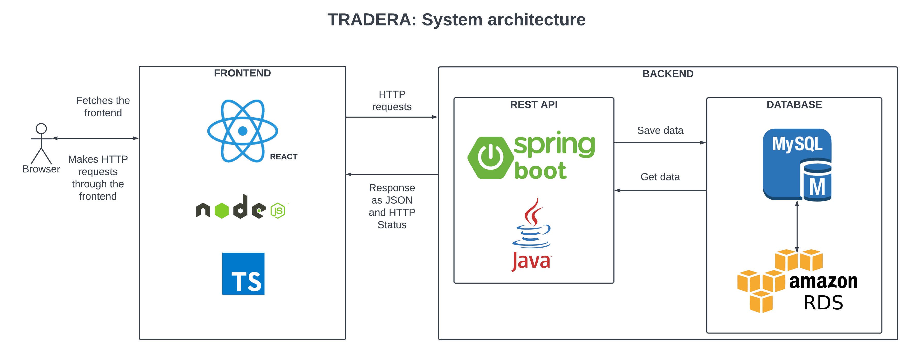

# Tradera Backend
Project 6 of Intensive Java Course.
Novare Potential and TietoEvry

## Table of contents
* [Introduction](#introduction)
* [Collaboration](#collaboration)
* [Technologies](#technologies)
* [Documents](#documents)
* [Run](#run)

# Introduction
Tradera is an online platform for selling items through auction.
Traders can add item so that other user can bid for it and the winner will be able to buy the product.
Tradera Backend is the backbone of this project, it provides RESTful APIs for the frontend.
It is built on springboot and uses mysql database which is hosted on AWS RDS.

# Collaboration
This is a team project, all Project management, Frontend and backend are developed in collaboration.

### Team Members -
1. Malla Gronqvist
2. Mumtaz Fatima 
3. Rashmoni Dey

## Technologies used for backend project
* Java 17
* Spring Boot 2.7.4
* Spring Data JPA
* Spring Security
* MySQL 8 - AWS RDS
* Lombok

## System Architecture

## Project Management Documents
Project Management Documents:
- [Trello Board](https://trello.com/invite/accept-board)
- [Database tables](https://docs.google.com/spreadsheets/d/1T2gENP0D5af4C3MKHxBcD_KEomvTXT6Jq8_IT8mSzTA/edit#gid=674144426)
- [Database design](https://drive.google.com/file/d/1KD45lEZaYMRDiPXizOL4jeWYI-HImnre/view)
- [End points](https://docs.google.com/spreadsheets/d/10_qHvUzAGsDIyNdI4C2plUyh3_68f2mYYNZOdGGC72Q/edit#gid=0)

## Run
To run this application do the following steps.
1. git clone https://github.com/rashmoni/tradera-backend.git
2. cd tradera-backend
3. mvn install
4. java -jar tradera-backend.jar
5. Make sure "upload-dir" is present beside src in project directory, the images are served from this directory.

## Folder structure -
/tradera-backend
- src
- logs
- upload-dir
- pom.xml